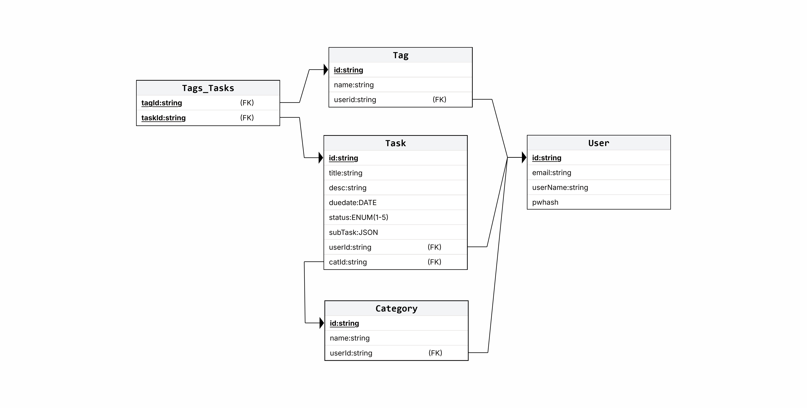

# TodoList API

A **Clean Architecture** backend for a personal task management application built with **.NET 10**, **Entity Framework Core**, **ASP.NET Core Identity**, and **JWT authentication**. The API supports full CRUD for tasks, categories, tags, and user management with role-based access.

## Project Status

The project is fully functional with the following capabilities:

- [x] User registration and login with JWT (access + refresh tokens)
- [x] Task CRUD with subtasks, status, due dates, categories, and tags
- [x] Category CRUD (per-user scoped)
- [x] Tag CRUD (many-to-many relationship with tasks)
- [x] User listing
- [x] Input validation via FluentValidation
- [x] Global exception handling middleware
- [x] Swagger/OpenAPI documentation with JWT bearer auth
- [x] AutoMapper for entity-to-DTO mapping
- [x] EF Core migrations with auto-seeded admin user
- [x] CORS policy configured for Angular frontend
- [x] Asymmetric RSA key pair (RS256) for JWT signing
- [x] HTTP integration tests (REST Client format)

**Note:** EF Core migrations have not been generated yet — the `AppDbContextModelSnapshot.cs` file is empty. Run `dotnet ef migrations add InitialCreate` before the first launch (or let `DbInitializer` handle it at startup).

## Tech Stack

| Technology            | Version |
| --------------------- | ------- |
| .NET                  | 10.0    |
| Entity Framework Core | 10.0.7  |
| ASP.NET Core Identity | 10.0.7  |
| JWT Bearer Auth       | 10.0.7  |
| AutoMapper            | 16.1.1  |
| FluentValidation      | 12.1.1  |
| Swashbuckle (Swagger) | 10.1.7  |
| SQL Server (LocalDB)  | LocalDB |

## Architecture

The solution follows **Clean Architecture** principles with four projects:

```
TodoList.Domain      → Entities, repository interfaces (no dependencies)
TodoList.Application → DTOs, services, mappings, application interfaces
TodoList.Infrastructure → EF Core, repositories, JWT provider, DB seeding
TodoList.API         → Controllers, middleware, validation, startup
```

Dependency flow: `API → Application → Domain` and `API → Infrastructure → Application + Domain`.

### File Structure and Clean Architecture

The following structure demonstrates the separation of concerns. The Domain layer remains independent, while Infrastructure handles data persistence and Application manages business logic and DTO mapping.

```text
todolist/
├── backend/
│   ├── TodoList.API/           # Entry point, Controllers, and Program.cs
│   ├── TodoList.Application/   # DTOs, Interfaces, Mappings, and Services
│   ├── TodoList.Domain/        # Entities and Repository Interfaces
│   └── TodoList.Infrastructure/# Data Context, Repositories, and Migrations
│
...
│
└── frontend/                   # Angular front end
```

## Data Model

### Entities

| Entity       | Description                                                                                    |
| ------------ | ---------------------------------------------------------------------------------------------- |
| **User**     | Custom Identity user with `RefreshToken` and `RefreshTokenExpiryTime`                          |
| **TaskItem** | Core task with title, description, due date, status (1-5), subtasks (JSON), category, and tags |
| **SubTask**  | Owned value object stored as JSON array within TaskItem                                        |
| **Category** | User-scoped task categories                                                                    |
| **Tag**      | User-scoped labels with many-to-many relationship to tasks (join table `TaskTags`)             |

### Entity Relationships

```
User (1) ──< TaskItem (N)
User (1) ──< Category (N)
User (1) ──< Tag (N)
Category (1) ──< TaskItem (N)
TaskItem (M) >──< Tag (N)  [via TaskTags]
```

### Data Model (Entity Relationship Diagram)

The database schema is designed to handle user authentication and relational note management efficiently. This diagram illustrates the core entities and their relationships within the Azure SQL instance.



## Getting Started

### Prerequisites

- .NET 10 SDK
- SQL Server LocalDB (comes with Visual Studio) or full SQL Server

### Setup

1. **Clone the repository** and navigate to `backend/`
2. **Generate EF Core migrations** (first time only):
    ```bash
    dotnet ef migrations add InitialCreate
    ```
3. **Run the API**:

    ```bash
    dotnet run --project TodoList.API
    ```

    The API starts at `http://localhost:5124`. Swagger UI is available at `http://localhost:5124/swagger`.

### Default Admin Account

On first run, the application seeds an admin user:

| Field    | Value                |
| -------- | -------------------- |
| Email    | `admin@todolist.com` |
| Username | `admin`              |
| Password | `Admin123!`          |

## API Endpoints

### Authentication (`api/Auth`)

| Method | Path                 | Description                        |
| ------ | -------------------- | ---------------------------------- |
| POST   | `/api/Auth/register` | Register a new user                |
| POST   | `/api/Auth/login`    | Login, returns JWT + refresh token |
| POST   | `/api/Auth/refresh`  | Refresh expired access token       |

### Tasks (`api/Tasks`)

All task endpoints require a valid JWT (`Authorization: Bearer <token>`).

| Method | Path                   | Description                               |
| ------ | ---------------------- | ----------------------------------------- |
| GET    | `/api/Tasks`           | List all tasks for the authenticated user |
| POST   | `/api/Tasks`           | Create a new task                         |
| PUT    | `/api/Tasks/{id}`      | Update a task                             |
| DELETE | `/api/Tasks/{id:guid}` | Delete a task                             |

### Categories (`api/Categories`)

| Method | Path                        | Description          |
| ------ | --------------------------- | -------------------- |
| GET    | `/api/Categories`           | List user categories |
| POST   | `/api/Categories`           | Create a category    |
| PUT    | `/api/Categories/{id:guid}` | Update a category    |
| DELETE | `/api/Categories/{id:guid}` | Delete a category    |

### Tags (`api/Tags`)

| Method | Path                  | Description    |
| ------ | --------------------- | -------------- |
| GET    | `/api/Tags`           | List user tags |
| POST   | `/api/Tags`           | Create a tag   |
| DELETE | `/api/Tags/{id:guid}` | Delete a tag   |

### Users (`api/Users`)

| Method | Path         | Description               |
| ------ | ------------ | ------------------------- |
| GET    | `/api/Users` | List all registered users |

### Health Check

| Method | Path              | Description                    |
| ------ | ----------------- | ------------------------------ |
| GET    | `/api/HelloWorld` | Returns `"hello from the api"` |

### Task Status Values

| Value | Name        |
| ----- | ----------- |
| 1     | Pending     |
| 2     | In Progress |
| 3     | On Hold     |
| 4     | Completed   |
| 5     | Canceled    |

## Testing

HTTP integration tests are located in `TodoList.API/Tests/`. They are formatted as `.http` files compatible with Visual Studio's REST Client or VS Code's REST Client extension:

- `auth-tests.http`
- `task-tests.http`
- `category-tests.http`
- `tag-tests.http`
- `integration-test.http` (full CRUD flow)

## Configuration

Key settings in `appsettings.json`:

- **ConnectionStrings:DefaultConnection** — SQL Server connection string (LocalDB by default)
- **Jwt** — RSA private/public keys (PEM), issuer, and audience
- **IdentityOptions** — Password policy and user settings
- **CORS** — Frontend URL allowed (default `http://localhost:3000`)
